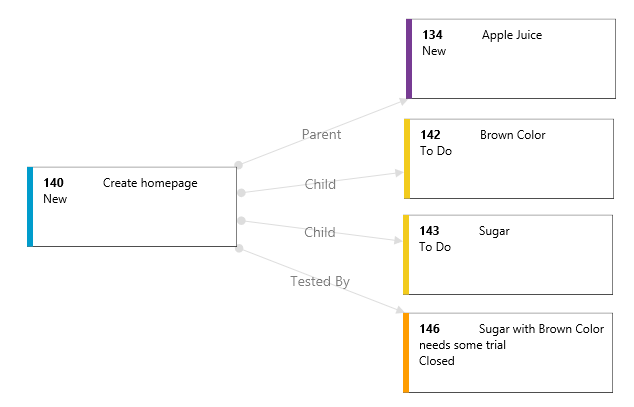
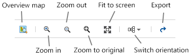
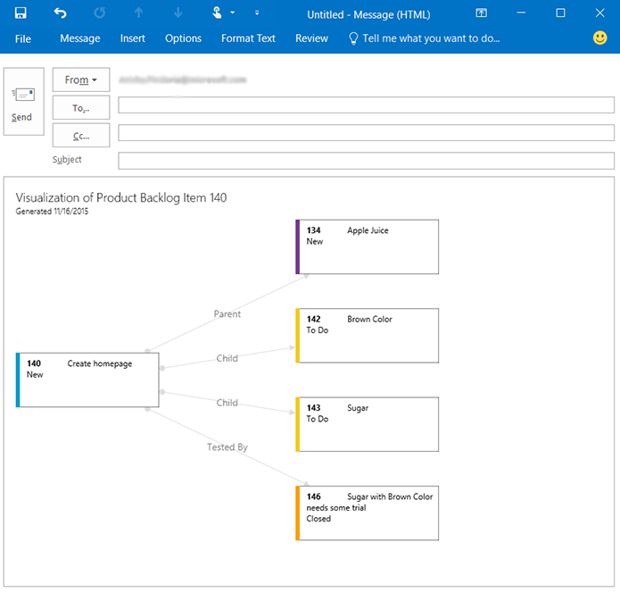

## Visualize work item relationships ##

 In Visual Studio Team Services you can add, edit and display work items in query results and various boards. With this extension you can visualize these work items from within the work item form. 

### Drill-down in your chart and even visualize commits ###

You can visually see how work items relate to each other, as well as code, tests, test results, builds and external artifacts. Even drill into your commits to explore the changeset details.

### Highlight what's important ###
Use colors to highlight important work item types within your visualization.

### Focus on what's important ###
Use `Zoom In`, `Zoom Out`, `Zoom to original size` or `Fit To` toolbar icons to zoom in and out of your chart. Switch the orientation of your chart between `horizontal` and `vertical` view.

### Export for offline viewing (Currently only supported on VSTS) ###
Export your chart visualization for offline viewing or printing. 

## Quick steps to get started ##

- **Visualize**
	1. Select a work item. 
		- If you are using the classic WI item form, select `Visualize` on the toolbar.
		- Otherwise click on `...` and select `Visualize`.
		- Visualization dialog will open up with the selected work item and its direct links expanded.
	1. Left click on the card on the graph to expand its links.
	1. Right click on a card on the graph to open the item in a new window.
	1. Click on `Zoom In`, `Zoom Out`, `Zoom to original size` or `Fit To icons` on the toolbar to re-size.
- **Visualize from Query**
	1. Create or Open a Query.
	2. Select one or many work items.
	3. Right Click and open context menu, select `Visualize`.
	
- **Highlight**
	1. Click on the `Toggle Legend Pane` icon on the right. A pane will expand.
	2. Click on `add highlight`. A modal dialog will open to add.
	3. Select `Work Item Type`, `Feature`, and enter `color` (ie. red) in text color. 
	4. Click `Save` to apply the highlighting.

[View Notices](https://marketplace.visualstudio.com/_apis/public/gallery/publisher/ms-devlabs/extension/WorkitemVisualization/latest/assetbyname/ThirdPartyNotice.txt) for third party software included in this extension.

> Microsoft DevLabs is an outlet for experiments from Microsoft, experiments that represent some of the latest ideas around developer tools. Solutions in this category are designed for broad usage, and you are encouraged to use and provide feedback on them; however, these extensions are not supported nor are any commitments made as to their longevity.

##Contributors##

We thank the following contributor(s) for this extension: Taavi Koosaar, Mattias Sköld.

##Release History##

### v1.2.0 ###

It is recommended to have Team Foundation Server 2015 Update 3 when running on-premis!

- **New Features **
	1. You can now Visualize from Work Item Form, Backlog Item list (selecting one or many items) or Query (selecting one or many items)

- **Bug fixes **

	1. Fixed issues when title contained &, <, >, ", ' characters and grey box was shown.
	1. Fixed issues with right-clicking card to navigate to item, commit, file etc

