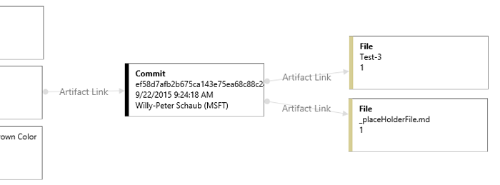

## Visualize work item relationships

 In Visual Studio Team Services you can add, edit and display work items in query results and various boards. With this extension you can visualize these work items from within the work item form. 

### Drill-down in your chart and even visualize commits

You can visually see how work items relate to each other, as well as code, tests, test results, builds and external artifacts. Even drill into your commits to explore the changeset details.

### Highlight what's important
Use colors to highlight important work item types within your visualization.

### Focus on what's important
Use `Zoom In`, `Zoom Out`, `Zoom to original size` or `Fit To` toolbar icons to zoom in and out of your chart. Switch the orientation of your chart between `horizontal` and `vertical` view.

### Export for offline viewing
Export your chart visualization for offline viewing or printing. 

### Add annotations to items on visulization

> **NEW** - *This is an early version with limited functionality. Please provide feedback.*

We have now added possibility to add additional annotations to the visualizations and pin them to the items on visualization. 

### Save visualizations on project level to share

> **NEW** - *This is an early version with limited functionality. Please provide feedback.*

We have now added possibility to save and share visualizations on project level.  

### Find on visualization

> **NEW** - *This is an early version with limited functionality. Please provide feedback.*

Previously the find on visualization allowed to enter and id and start visualization from it. Since we have visualization possible from all contexts now we deemed this unnecessary and thought it may be more useful to allow searching items on the visualization instead.  

## Quick steps to get started

- **Visualize from Work Item form or Board**
	1. Select a work item. 
		- If you are using the classic WI item form, select `Visualize` on the toolbar.
		- Otherwise click on `...` and select `Visualize`.
		- Visualization dialog will open up with the selected work item and its direct links expanded.
	1. Left click on the card on the graph to expand its links.
	1. Right click on a card on the graph to open the item in a new window.
	1. Click on `Zoom In`, `Zoom Out`, `Zoom to original size` or `Fit To icons` on the toolbar to re-size.
- **Visualize from Query or Backlog items view**
	1. Open backlog or Create / Open a Query.
	2. Select one or many work items.
	3. Right Click and open context menu, select `Visualize`.
	
- **Highlight**
	1. Click on the `Toggle Legend Pane` icon on the right. A pane will expand.
	2. Click on `add highlight`. A modal dialog will open to add.
	3. Select `Work Item Type`, `Feature`, and enter `color` (ie. red) in text color. 
	4. Click `Save` to apply the highlighting.

[View Notices](https://marketplace.visualstudio.com/_apis/public/gallery/publisher/ms-devlabs/extension/WorkitemVisualization/latest/assetbyname/ThirdPartyNotice.txt) for third party software included in this extension.

> Microsoft DevLabs is an outlet for experiments from Microsoft, experiments that represent some of the latest ideas around developer tools. Solutions in this category are designed for broad usage, and you are encouraged to use and provide feedback on them; however, these extensions are not supported nor are any commitments made as to their longevity.

### TFS On-Premis

We recommend TFS 2015 Update 3 when running this extension.

## Contributors

We thank the following contributor(s) for this extension: Taavi Koosaar and Mattias Sköld.

## Feedback

We need your feedback! Here are some of the ways to connect with us:

- Add a review below
- Send us an [email](mailto://mktdevlabs@microsoft.com).

Review the [list of features and resolved issues of latest tools and extensions](https://aka.ms/vsarreleases) for more information on latest releases. 
